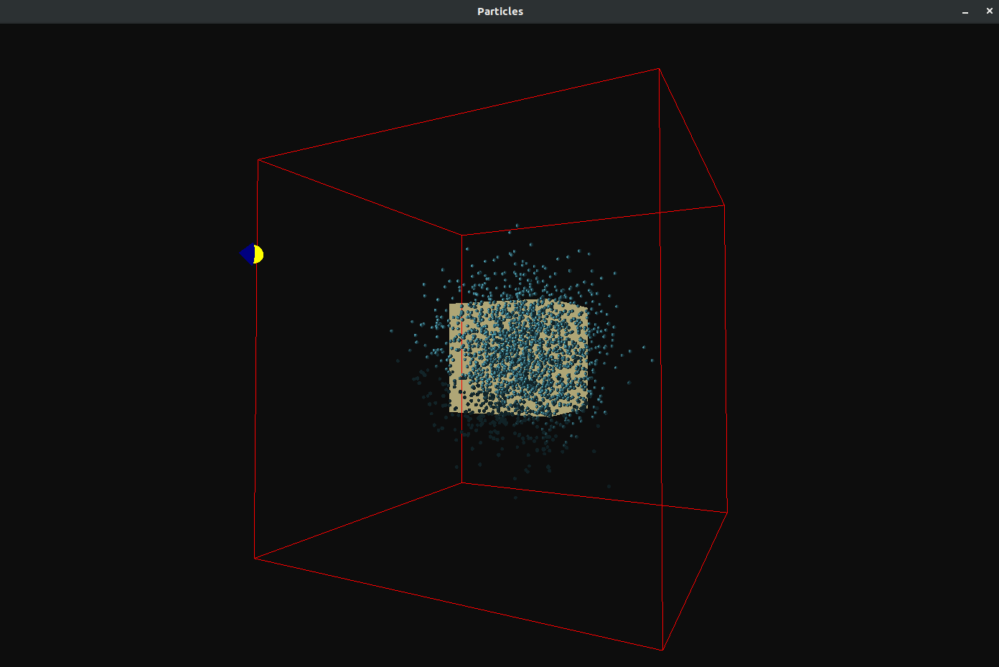
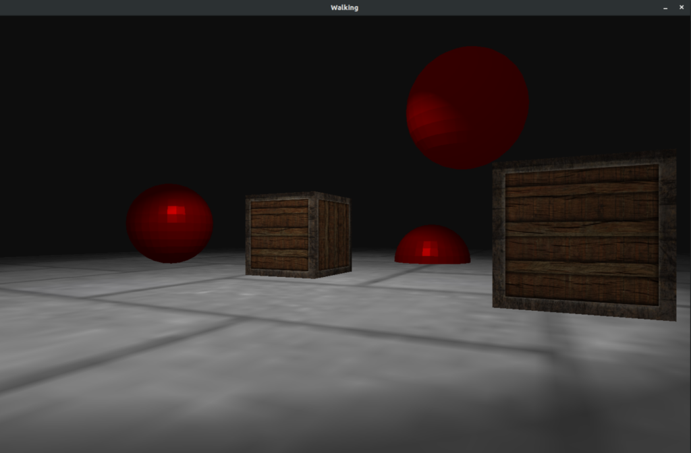
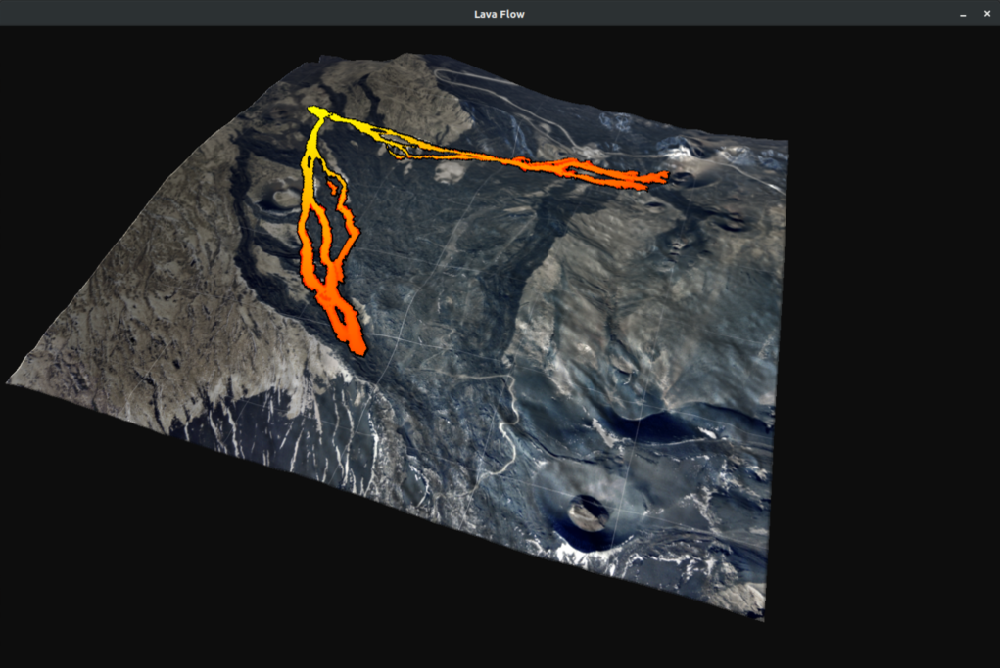

# Computer Graphics Project

Useful resource for OpenGL: https://learnopengl.com/

Build a project:
```
cd ${project_folder}
mkdir build
cd build
cmake ..
make
./${project_exe}

```

## Particles 
 

## Walking 
 

## Lava Flow
 
